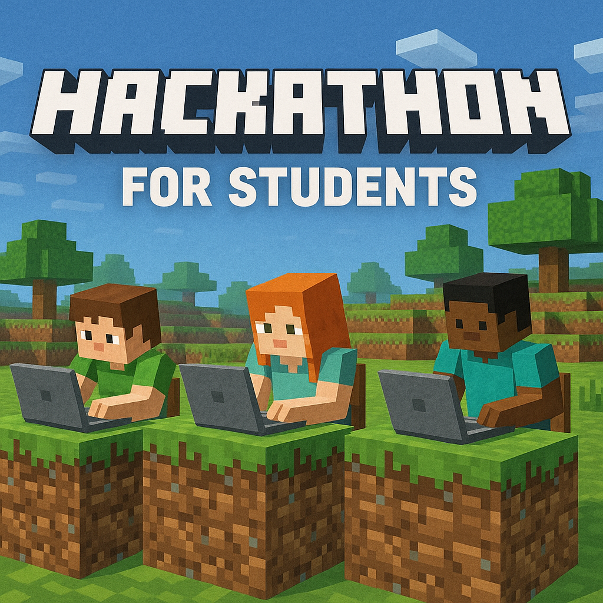

# 🟩 Minecraft CodeCraft: Student Hackathon 2025

  

🎮 **Welcome to CodeCraft!**  
Are you ready to dig deep, craft clever solutions, and build your way to glory?  
This student hackathon will test your logic, creativity, and problem-solving abilities – all wrapped in a **Minecraft-themed adventure**!

---

## ⚙️ Rules
- Clone this repo, and create a folder with your name and surname:
  - Folder: *Hackathon/JohnDoe*
- All code must be submitted at **THE END** of the hackathon, in your own branch, and a seperate folder:
  - Branch name: *NameSurname*
- **Absolutely NO** AI is allowed.
  - Not even copilot.
- When you think you have the answer of Part 1, raise your hand.
  - Show the judge your answer, and they will tell you if you're correct.
- When Part 1 is correct, you can continue to Part 2.
- You can do the problems in any order.

---

## 🧱 Overview

The mines are deep. The mobs are restless. The Redstone circuits are on the fritz.  
It's up to **you** to solve a series of programming puzzles scattered throughout the pixelated realm.

🕹 Each challenge is a standalone coding problem, ranging from logic puzzles to string manipulation to simulation challenges – all Minecraft-themed to keep things fun and immersive!

---

## 📅 Schedule

| Date           | Event                     |
|----------------|---------------------------|
| [Problem 1](problem_1_minecraft_theme.md)      | Treasure Map Calibration  | 
| [Problem 2](problem_2_problem.md)      | Cube Conundrum            |
| [Problem 3](problem_3.md)      | Gear Ratios               |

---

## 🛠 What You'll Need

- Your coding skills ⚙️  
- A language of your choice (Python, C#, JavaScript, etc.)  
- A creative brain ready to **mine for ideas** and **craft solutions**  
- A GitHub account (to submit your code)

---

## 🧩 Challenge Structure

Each hour, a new Minecraft-themed problem will be done:

- **Problem 1: Treasure Map Calibration**  
  Your goal is to restore the decoder system by extracting calibration values.

- **Problem 2: Cube Conundrum**  
  **Skyblock Island**, a floating ruin where an Elf offers a puzzling game

- **Problem 3: Gear Ratios (Redstone Engineering)**  
  Decode part IDs and gear connections from a contraption schematic.

Each problem will include:
- A detailed story (Minecraft-themed)
- Input/output format
- Sample inputs

---

## 🧾 Submission Instructions

1. Fork this repo 📦  
2. Create a folder for yourself  
3. Submit a solution file for each problem (`problem_1_solution.py`, etc.)  
4. Include a brief `README.md` inside your folder describing how to run your code  
5. Push to your fork and submit a PR to this repo before the deadline

---

## 🏆 Scoring

- ✅ Correctness: 60%  
- ⚡️ Efficiency: 20%  
- ✨ Creativity / Code style: 20%  

Bonus points for:
- Clean code
- Readable comments
- Fun variable names (we're looking at you, `creeperCount` and `diamondStacks`)

---

## 🧑‍💻 Who Can Participate?

- Students only (high school or university)
- Solo players only
- Must love Minecraft… or at least pretend to 😄

---

## 🎁 Prizes

- Eternal glory in the Hall of Fame (aka this repo)

---

## 📣 Tips for Success

- Think before you code: understand the problem first!
- Test your code with sample and edge cases
- Use Git early and often
- Have fun! This is your time to **craft code like a pro** 🧠🪓

---

## 📫 Need Help?
***Talk to a senior***

Let the best miner win.  
**Hack the block. Craft the win.**

🟨🟩🟦 Good luck, CodeCrafters! 🟦🟩🟨
