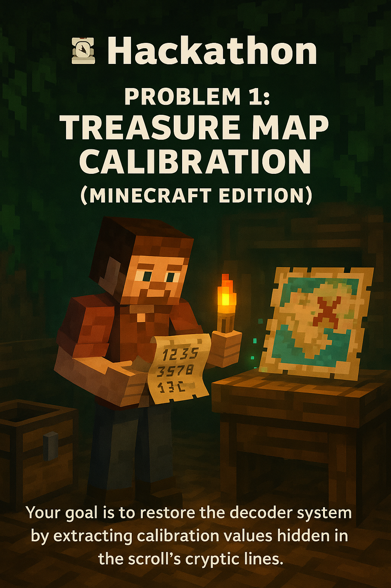

# 🧭 Hackathon — Problem 1: Treasure Map Calibration *(Minecraft Edition)*



You're a wandering redstone engineer exploring an ancient **cartographer's hut** deep in the Overworld jungle. In a dusty chest, you find a **tattered calibration scroll** used by legendary Minecraft explorers to align enchanted **treasure maps**.

Your goal is to restore the decoder system by extracting calibration values hidden in the scroll’s cryptic lines.

---

## 🧱 Part 1

Each line in the scroll contains a mix of symbols, item names, and gibberish—but also at least one **digit**.

Your task is to find the **first digit** and the **last digit** in each line. Combine them (in that order) to create a **two-digit calibration value** for that line.

If a line contains only one digit, use it for both the first and last digit.

### 🧪 Example:

Given the following scroll contents:

```
1abc2
pqr3stu8vwx
a1b2c3d4e5f
treasure8
x7x
```

The calibration values would be:
- `1abc2` → 12  
- `pqr3stu8vwx` → 38  
- `a1b2c3d4e5f` → 15  
- `treasure8` → 88  
- `x7x` → 77  

**Sum: 12 + 38 + 15 + 88 + 77 = 230**

### 🎯 Task:

What is the **sum of all calibration values** in your Minecraft scroll?

Input: [Problem Input](problem_1_input.txt)

---

## 🪄 Part 2

As you finish basic calibration, your enchanted treasure map glows—but it's still misaligned. You now notice that some numbers are spelled out in **cartographer runes** to confuse thieves and pillagers.

So, in addition to regular digits (`1` to `9`), lines may also contain **spelled-out digits**, such as `"two"` or `"seven"`, which must be treated as valid digits too.

You must still extract the **first** and **last** number found in each line—**whether it's a digit or spelled-out word**—and combine them into a two-digit calibration value.

### Valid number words:

> `one`, `two`, `three`, `four`, `five`, `six`, `seven`, `eight`, `nine`

> *(There is no `"zero"`.)*

⚠️ **Overlapping words** are possible:
```
eightwothree
```
Here, you must detect:
- `eight` → 8  
- `two` → 2  
- `three` → 3  
First number is 8, last is 3 → **83**

### 🧪 Example:

Given:
```
two1nine  
eightwothree  
abcone2threexyz  
xtwone3four  
4nineeightseven2  
zoneight234  
7pqrstsixteen
```

You get:
- `two1nine` → 2 and 9 → **29**  
- `eightwothree` → 8 and 3 → **83**  
- `abcone2threexyz` → 1 and 3 → **13**  
- `xtwone3four` → 2 and 4 → **24**  
- `4nineeightseven2` → 4 and 2 → **42**  
- `zoneight234` → 1 and 4 → **14**  
- `7pqrstsixteen` → 7 and 6 → **76**

**Sum: 29 + 83 + 13 + 24 + 42 + 14 + 76 = 281**

### 🎯 Task:

What is the **sum of all calibration values**, including both digits and spelled-out numbers, in your scroll?

**Input:** [Problem Input](problem_1_input.txt)
