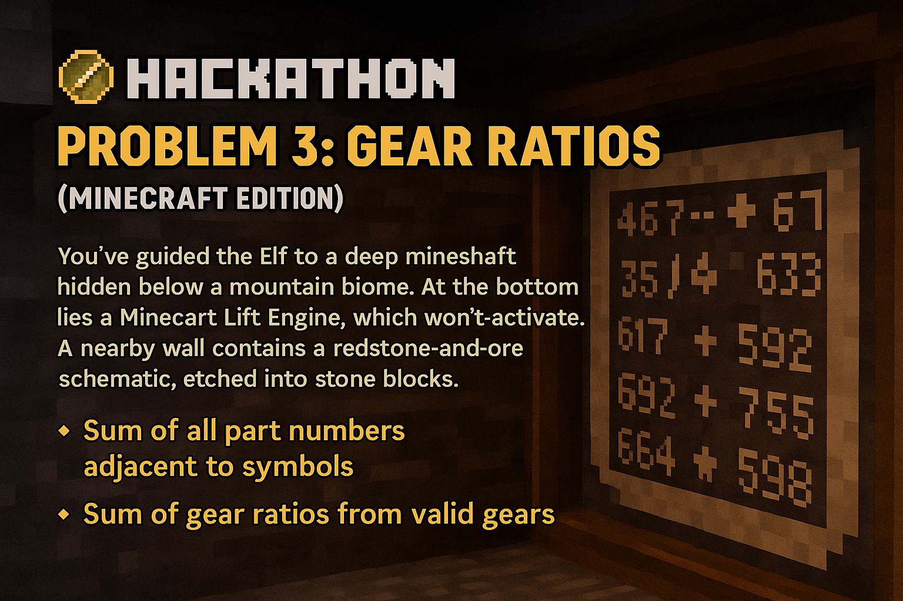

# 🧭 Problem 3: Gear Ratios *(Minecraft Edition)*



You've guided the Elf to a **deep mineshaft** hidden below a mountain biome. At the bottom lies a **Minecart Lift Engine**, which won't activate. A nearby wall contains a redstone-and-ore **schematic**, etched into stone blocks.

The schematic reveals part numbers and special redstone symbols. Your task is to interpret it and figure out what components are needed.

A **part number** is any sequence of digits. A **symbol** is any character that is **not a digit and not a period (`.`)**. Empty space is shown as `.`.

Your job is to find all the **part numbers that are adjacent** to any symbol. Adjacent means **horizontally, vertically, or diagonally**.

---

## 🧱 Part 1

A part number is **valid** if it is adjacent to **any** symbol (e.g. `#`, `*`, `+`, etc.). Your task is to **sum all valid part numbers**.

### 🧪 Example:

```
467..114..
...*......
..35..633.
......#...
617*......
.....+.58.
..592.....
......755.
...$.*....
.664.598..
```

In this schematic:
- The symbols are: `*`, `#`, `+`, `$`
- The valid part numbers (those adjacent to a symbol) are:  
  `467`, `35`, `633`, `617`, `592`, `755`, `664`, `598`  
- The number `114` and `58` are **not** adjacent to any symbol and are ignored.

**Sum: 467 + 35 + 633 + 617 + 592 + 755 + 664 + 598 = 4361**

### 🎯 Task:

What is the **sum of all part numbers** in your Minecraft schematic that are adjacent to a symbol?

**Input:** [Problem Input](problem_3_input.txt)

---

## ⚙️ Part 2

You notice that some symbols are **gears**, represented by `*`. A gear is **valid** if it is adjacent to **exactly two part numbers**.

The **gear ratio** is the **product** of the two part numbers adjacent to the gear.

Your new task: **Find all valid gears** and sum their gear ratios.

### 🧪 Example:

From the same schematic above:
- There are two valid gears:
  - The `*` in line 2 is adjacent to `467` and `35` → ratio = `467 * 35 = 16345`
  - The `*` in line 9 is adjacent to `755` and `598` → ratio = `755 * 598 = 451490`
- All other `*` are either adjacent to one or more than two numbers.

**Total sum of gear ratios: 16345 + 451490 = 467835**

### 🎯 Task:

What is the **sum of all gear ratios** from valid gears in your schematic?

---

## 📝 Your Input

Place your puzzle input schematic here. Then:

- **Part 1 answer**: sum of all valid part numbers (adjacent to symbols)  
- **Part 2 answer**: sum of gear ratios (for valid gears adjacent to exactly 2 part numbers)

Activate the Minecart Lift Engine and uncover what lies beneath the mountain...

**Input:** [Problem Input](problem_3_input.txt)
